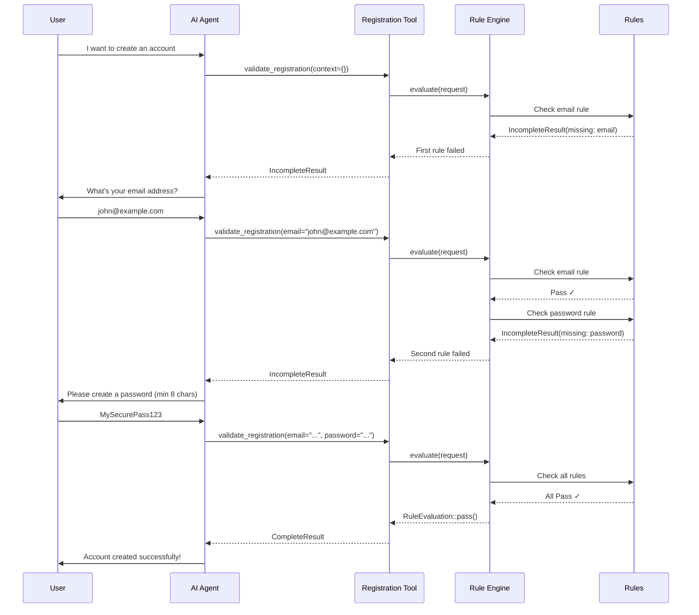

# Agent Rules

A declarative rule engine designed for conversational agents, AI assistants, and interactive workflows.

Perfect for building chatbots, AI agents, CLI wizards, or any system that guides users through multi-step processes by asking questions and validating responses.

## Overview

Agent Rules provides a logical processing unit for handling **unstructured input in a structured and interactive way**. It enables you to define validation rules that can request missing information, enforce business logic, and provide intelligent feedback to users or AI agents.

Built on top of [Symfony AI Agent](https://github.com/symfony/ai-agent), this library integrates seamlessly with AI-powered tools and conversational interfaces.

## Key Features

- **Declarative Rule Definition**: Define validation logic as composable rule objects
- **Automatic Dependency Resolution**: Rules declare dependencies, engine handles execution order
- **Interactive Feedback**: Rules can request missing data with structured result types
- **Composable Logic**: Combine rules with `Sequence` (AND), `Any` (OR), and `Either` patterns
- **Type-Safe**: Full PHP 8.4+ type safety with readonly classes and generic support
- **AI Agent Integration**: Built-in support for Symfony AI Agent's source tracking and tool system

## Installation

```bash
composer require phpro/agent-rules
```

## Quick Start

### 1. Define Your Subject

The subject is the data being validated:

```php
final class OrderRequest
{
    public function __construct(
        public readonly ?string $email,
        public readonly ?string $productId,
        public readonly ?int $quantity,
    ) {}
}
```

### 2. Create Validation Rules

Each rule checks one aspect and can request missing information:

```php
use Phpro\AgentRules\RuleInterface;
use Phpro\AgentRules\RuleEvaluation;
use Phpro\AgentRules\Result\IncompleteResult;

/**
 * @implements RuleInterface<OrderRequest>
 */
class EmailRule implements RuleInterface
{
    public function name(): string
    {
        return 'email_validation';
    }

    public function dependencies(): array
    {
        return []; // No dependencies
    }

    public function check(mixed $subject): RuleEvaluation
    {
        // Missing email? Ask for it!
        if ($subject->email === null) {
            return RuleEvaluation::respond(
                new IncompleteResult(
                    missingField: 'email',
                    message: 'Please provide your email address to proceed.'
                )
            );
        }

        // Invalid format? Request correction!
        if (!filter_var($subject->email, FILTER_VALIDATE_EMAIL)) {
            return RuleEvaluation::respond(
                new IncompleteResult(
                    missingField: 'email',
                    message: 'The email address is invalid. Please provide a valid email.'
                )
            );
        }

        // All good!
        return RuleEvaluation::pass();
    }
}
```

### 3. Run the Engine

```php
use Phpro\AgentRules\RuleEngine;

$engine = new RuleEngine(
    new EmailRule(),
    new ProductRule(),
    new QuantityRule(),
);

$request = new OrderRequest(
    email: null,
    productId: 'PROD-123',
    quantity: 2
);

$evaluation = $engine->evaluate($request);

if (!$evaluation->isPass()) {
    $result = $evaluation->result;
    echo $result->message; // "Please provide your email address to proceed."
    echo $result->missingField; // "email"
}
```

## Result Types

The engine provides four result types to communicate different states:

| Result Type | Status | Use Case | Key Fields |
|-------------|--------|----------|------------|
| `CompleteResult` | `complete` | Validation passed | `message` |
| `IncompleteResult` | `incomplete` | Missing/invalid data | `missingField`, `message` |
| `BlockedResult` | `blocked` | Access denied | `reason`, `message` |
| `ErrorResult` | `error` | Processing error | `message`, `resolution` |

### Complete Result

```php
return RuleEvaluation::respond(
    new CompleteResult(
        message: 'Order validated successfully!'
    )
);
```

### Incomplete Result

```php
return RuleEvaluation::respond(
    new IncompleteResult(
        missingField: 'shippingAddress',
        message: 'We need your shipping address to complete the order.'
    )
);
```

### Blocked Result

```php
return RuleEvaluation::respond(
    new BlockedResult(
        reason: 'Product out of stock',
        message: 'This product is currently unavailable.'
    )
);
```

### Error Result

```php
return RuleEvaluation::respond(
    new ErrorResult(
        message: 'Unable to validate product availability.',
        resolution: 'Please try again later or contact support.'
    )
);
```

## Composable Rules

### Sequence (AND Logic)

All rules must pass. First failure stops execution:

```php
use Phpro\AgentRules\Sequence;

$allRequired = new Sequence(
    new EmailRule(),
    new ProductRule(),
    new QuantityRule(),
);
```

### Any (OR Logic)

At least one rule must pass:

```php
use Phpro\AgentRules\Any;

$paymentMethod = new Any(
    new CreditCardRule(),
    new PayPalRule(),
    new BankTransferRule(),
);
```

### Either (Binary Choice)

Try left, fall back to right:

```php
use Phpro\AgentRules\Either;

$authentication = new Either(
    new OAuthRule(),
    new PasswordRule(),
);
```

## Dependency Resolution

Rules can declare dependencies to ensure proper execution order:

```php
class DiscountRule implements RuleInterface
{
    public function dependencies(): array
    {
        return ['product_validation', 'user_authentication'];
    }

    public function name(): string
    {
        return 'discount_calculation';
    }

    public function check(mixed $subject): RuleEvaluation
    {
        // This runs only after dependencies pass
        // ...
    }
}
```

The engine automatically:
- Resolves dependency order using topological sort
- Detects cyclic dependencies
- Validates that all dependencies exist

## Integration with Symfony AI Agent

### Creating an AI Tool

```php
use Symfony\AI\Agent\Toolbox\Attribute\AsTool;
use Symfony\AI\Agent\Toolbox\Source\HasSourcesInterface;
use Symfony\AI\Agent\Toolbox\Source\HasSourcesTrait;

#[AsTool(
    name: 'validate_order',
    description: 'Validates customer order information and guides through missing data.'
)]
final class OrderValidationTool implements HasSourcesInterface
{
    use HasSourcesTrait;

    public function __construct(
        private RuleEngine $ruleEngine,
    ) {}

    public function __invoke(
        string $email,
        ?string $productId = null,
        ?int $quantity = null,
    ): ResultInterface {
        $request = new OrderRequest($email, $productId, $quantity);
        $evaluation = $this->ruleEngine->evaluate($request);

        $result = $evaluation->result ?? new CompleteResult(
            message: 'Order validation complete!'
        );

        // Track sources for AI agent context
        foreach ($result->sources()->getSources() as $source) {
            $this->addSource($source);
        }

        return $result;
    }
}
```

### Adding Sources for Context

```php
return RuleEvaluation::respond(
    (new IncompleteResult(
        missingField: 'productId',
        message: 'Please provide the product ID.'
    ))->addSources(
        new Source(
            name: 'Product Catalog',
            reference: 'https://example.com/products',
            content: 'Browse our product catalog to find product IDs.'
        )
    )
);
```

### Symfony Configuration

Configure the rule engine as a service:

```yaml
# config/services.yaml
services:
    OrderValidationEngine:
        class: Phpro\AgentRules\RuleEngine
        factory: ['Phpro\AgentRules\RuleEngine', 'fromIterable']
        arguments:
            - !tagged_iterator order.validation.rule
```

Tag your rules:

```php
use Symfony\Component\DependencyInjection\Attribute\AutoconfigureTag;

#[AutoconfigureTag('order.validation.rule', ['priority' => 100])]
class EmailRule implements RuleInterface
{
    // ...
}
```

## Real-World Example: Form Validation Assistant

Imagine building a conversational AI that helps users complete a multi-step registration form. The AI needs to:
- Ask for information in the right order
- Validate data as it's provided
- Give helpful feedback on errors
- Know when all required data is collected



### Implementation

```php
// 1. Define the request context
final class RegistrationRequest
{
    public function __construct(
        public readonly ?string $email = null,
        public readonly ?string $password = null,
        public readonly ?string $fullName = null,
        public readonly ?bool $termsAccepted = null,
    ) {}
}

// 2. Create validation rules
#[AutoconfigureTag('registration.rule', ['priority' => 100])]
class EmailRule implements RuleInterface
{
    public function name(): string { return 'email'; }
    public function dependencies(): array { return []; }

    public function check(mixed $subject): RuleEvaluation
    {
        if (!$subject->email) {
            return RuleEvaluation::respond(
                new IncompleteResult(
                    missingField: 'email',
                    message: "What's your email address?"
                )
            );
        }

        if (!filter_var($subject->email, FILTER_VALIDATE_EMAIL)) {
            return RuleEvaluation::respond(
                new IncompleteResult(
                    missingField: 'email',
                    message: 'Please provide a valid email address.'
                )
            );
        }

        return RuleEvaluation::pass();
    }
}

#[AutoconfigureTag('registration.rule', ['priority' => 90])]
class PasswordRule implements RuleInterface
{
    public function name(): string { return 'password'; }
    public function dependencies(): array { return ['email']; }

    public function check(mixed $subject): RuleEvaluation
    {
        if (!$subject->password) {
            return RuleEvaluation::respond(
                new IncompleteResult(
                    missingField: 'password',
                    message: 'Please create a password (minimum 8 characters).'
                )
            );
        }

        if (strlen($subject->password) < 8) {
            return RuleEvaluation::respond(
                new IncompleteResult(
                    missingField: 'password',
                    message: 'Password must be at least 8 characters long.'
                )
            );
        }

        return RuleEvaluation::pass();
    }
}

// 3. Create the AI tool
#[AsTool(
    name: 'validate_registration',
    description: 'Validates user registration data and requests missing information.'
)]
final class RegistrationTool implements HasSourcesInterface
{
    use HasSourcesTrait;

    public function __construct(
        #[Autowire(service: 'RegistrationEngine')]
        private RuleEngine $ruleEngine,
    ) {}

    public function __invoke(
        ?string $email = null,
        ?string $password = null,
        ?string $fullName = null,
        ?bool $termsAccepted = null,
    ): ResultInterface {
        $request = new RegistrationRequest(
            email: $email,
            password: $password,
            fullName: $fullName,
            termsAccepted: $termsAccepted,
        );

        $evaluation = $this->ruleEngine->evaluate($request);

        return $evaluation->result ?? new CompleteResult(
            message: 'Registration validated! Your account has been created.'
        );
    }
}

// 4. Configure the AI agent
// config/packages/ai.yaml
ai:
    agent:
        registration_assistant:
            platform: 'ai.platform.openai'
            model: 'gpt-4'
            prompt: |
                You help users create accounts by collecting required information.

                WORKFLOW:
                1. Call validate_registration with any info you have
                2. Tool returns what's missing → ask the user
                3. Call validate_registration again with ALL collected data
                4. Repeat until you get "complete" status

                NEVER make up information. Always call the tool to know what to ask next.
            tools:
                - { service: 'RegistrationTool' }
```

### Conversation Flow

```
User: I want to sign up

AI: [Calls validate_registration()]
    What's your email address?

User: john@example.com

AI: [Calls validate_registration(email="john@example.com")]
    Please create a password (minimum 8 characters).

User: MyPass

AI: [Calls validate_registration(email="...", password="MyPass")]
    Password must be at least 8 characters long.

User: MySecurePassword123

AI: [Calls validate_registration(email="...", password="MySecurePassword123")]
    What's your full name?

User: John Doe

AI: [Calls validate_registration(email="...", password="...", fullName="John Doe")]
    Registration validated! Your account has been created.
```

## Use Cases

### Chatbot Form Wizards
Guide users through complex forms by requesting one piece of information at a time based on validation rules.

### AI-Powered Customer Support
Validate customer requests interactively, asking clarifying questions when information is missing or invalid.

### CLI Configuration Tools
Build interactive command-line tools that guide users through setup by validating configuration step-by-step.

### API Request Validation
Validate API requests from AI agents, providing structured feedback on missing or invalid parameters.

### Document Processing Workflows
Check documents for completeness, requesting missing sections or data from users or automated systems.

## Advanced Patterns

### Conditional Rules

```php
class ConditionalShippingRule implements RuleInterface
{
    public function check(mixed $subject): RuleEvaluation
    {
        // Only check shipping if physical product
        if ($subject->productType !== 'physical') {
            return RuleEvaluation::pass();
        }

        if (!$subject->shippingAddress) {
            return RuleEvaluation::respond(
                new IncompleteResult(
                    missingField: 'shippingAddress',
                    message: 'Physical products require a shipping address.'
                )
            );
        }

        return RuleEvaluation::pass();
    }
}
```

### Nested Composites

```php
$checkoutValidation = new Sequence(
    new UserAuthenticationRule(),
    new Any(
        new GuestCheckoutRule(),
        new AccountRequiredRule(),
    ),
    new Either(
        new ExpressCheckoutRule(),
        new Sequence(
            new ShippingRule(),
            new PaymentRule(),
            new BillingRule(),
        ),
    ),
);
```

### Stateful Rules

```php
class InventoryRule implements RuleInterface
{
    public function __construct(
        private ProductRepository $products,
    ) {}

    public function check(mixed $subject): RuleEvaluation
    {
        $product = $this->products->find($subject->productId);

        if (!$product || $product->stock < $subject->quantity) {
            return RuleEvaluation::respond(
                new BlockedResult(
                    reason: 'Insufficient inventory',
                    message: 'This product is out of stock.'
                )
            );
        }

        return RuleEvaluation::pass();
    }
}
```

## Testing

```php
use PHPUnit\Framework\TestCase;

class EmailRuleTest extends TestCase
{
    public function test_it_requests_missing_email(): void
    {
        $rule = new EmailRule();
        $request = new OrderRequest(email: null, productId: 'P1', quantity: 1);

        $evaluation = $rule->check($request);

        $this->assertFalse($evaluation->isPass());
        $this->assertInstanceOf(IncompleteResult::class, $evaluation->result);
        $this->assertEquals('email', $evaluation->result->missingField);
    }

    public function test_it_validates_email_format(): void
    {
        $rule = new EmailRule();
        $request = new OrderRequest(email: 'invalid-email', productId: 'P1', quantity: 1);

        $evaluation = $rule->check($request);

        $this->assertFalse($evaluation->isPass());
        $this->assertStringContainsString('valid email', $evaluation->result->message);
    }

    public function test_it_passes_with_valid_email(): void
    {
        $rule = new EmailRule();
        $request = new OrderRequest(email: 'john@example.com', productId: 'P1', quantity: 1);

        $evaluation = $rule->check($request);

        $this->assertTrue($evaluation->isPass());
    }
}
```

## Architecture

### Design Principles

- **Immutability**: All classes are `readonly` and `final` for predictable behavior
- **Type Safety**: Full generic support with `@template` annotations
- **Composition**: Rules are composable building blocks
- **Separation of Concerns**: Each rule validates one aspect
- **Fail-Fast**: Short-circuit evaluation stops on first failure

### Core Components

```
RuleInterface<T>
    ↑
    ├── RuleEngine (orchestrator)
    ├── Sequence (AND composite)
    ├── Any (OR composite)
    ├── Either (binary composite)
    └── [Your custom rules]

RuleEvaluation
    ├── result: null (pass)
    └── result: ResultInterface (fail)

ResultInterface
    ├── CompleteResult
    ├── IncompleteResult
    ├── BlockedResult
    └── ErrorResult
```

## Performance Considerations

- **Short-Circuit Evaluation**: Execution stops at first failure
- **Lazy Evaluation**: Only evaluates rules in dependency order
- **Topological Sort**: O(V + E) dependency resolution using PSL Graph
- **No Reflection**: Pure constructor injection, no runtime reflection overhead

## Contributing

Contributions are welcome! Please feel free to submit a Pull Request.

## License

MIT License. See LICENSE file for details.

## Credits

Built by [Phpro](https://www.phpro.be/)

Author: Toon Verwerft (toon.verwerft@phpro.be)
